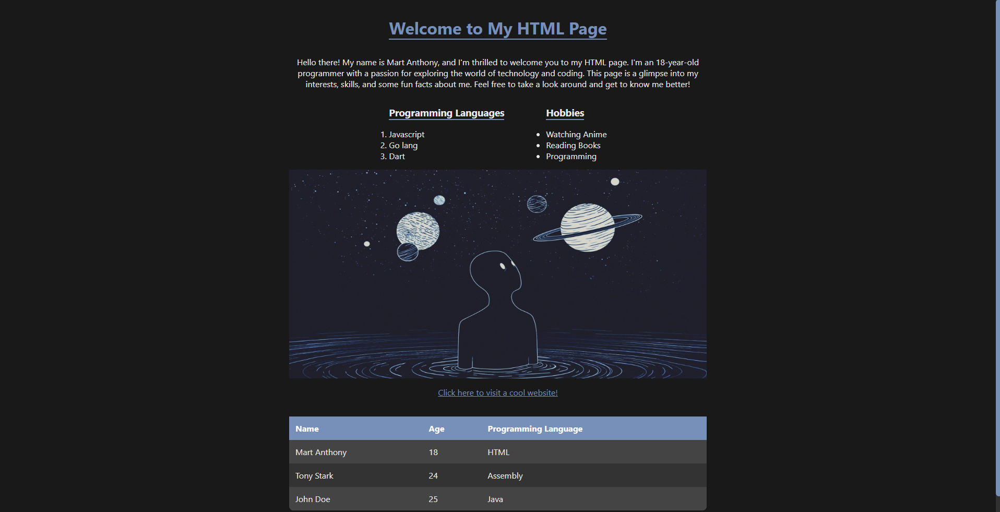

# Icreatechs Activity 1 Notes

In this activity, I learned the basics of HTML and CSS, enabling me to build a website. With HTML, I grasped how to create the foundation of a website, including paragraphs, images, and headers. CSS allowed me to style the HTML and modify its properties.

